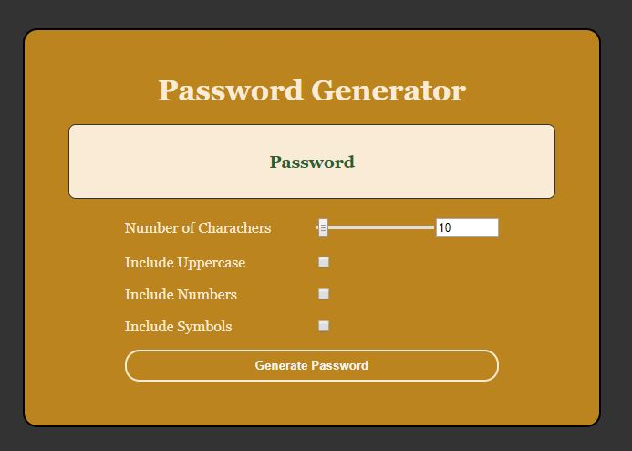
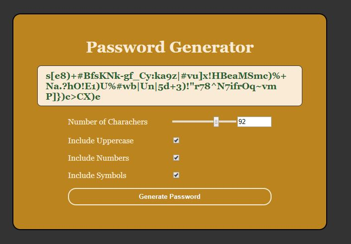

# Password Generator
This is a password generator made in Html, CSS and JavaScript.

<h2>Contents</h2>

The password generator in JavaScript is composed of 3 pages, index.html, style.css and script.js. 

<h2>User Story</h2>

  A user needs to create a password between 8 and 128 characters. These characters can be Upper or lower case, numbers & symbols, adding complexity to the password. The password should be random every time the generate password button is pressed.

<h4>Initial interface</h4>

<h4>Password Generated</h4>

<h3>Licence</h3>

<h2>Link to the App</h2>
<a href="https://johnnyboysydney.github.io/PasswordGenerator/.">Password Generator</a>

<>
